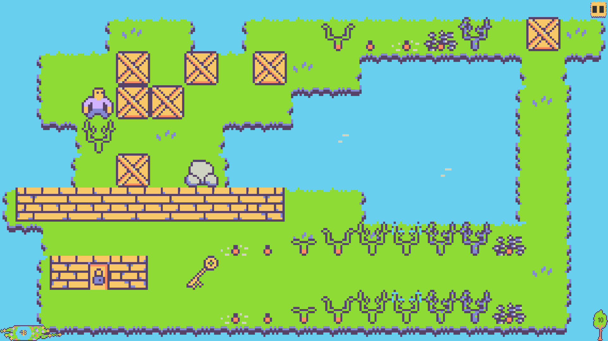

# PlantKeeper

My work for [Great Spring Game Jam: 2021](https://itch.io/jam/great-spring-game-jam-2021)

[View game page](https://ginoxxp.itch.io/plant-keeper)

## Theme of jam

The theme is what makes this game jam special. It's important that you incorporate the theme in order 
for it to be considered an official entry. This jam's theme is SPRING. So grab your watering can, put 
on your gardening hat, and get ready for those warm breezy winds.

## Palette

## Gameplay

The player's task is to go through the door to another level.

Some doors are closed. In order to open them you need to collect the key.

Player can push boxes

### Constant Growth

Plants constantly grow and die leaving seeds underneath from which a new plant will grow

It has 9 growth phases. 

On 4-7 phases plant becomes an obstacle for the player

